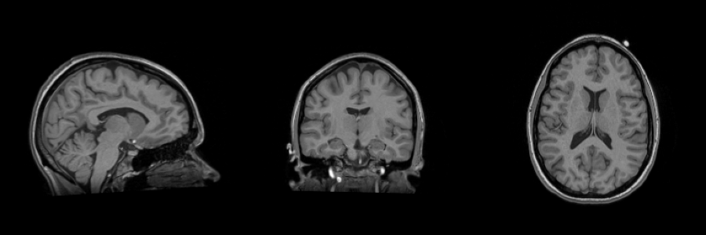

FSLEYEs layout
--------------

CLI
++++++

.. code-block:: bash

    nifti_overlay -A t1.nii.gz --transpose --nslices 1

Python
++++++

.. code-block:: python

    from nifti_overlay import NiftiOverlay

    overlay = NiftiOverlay(transpose=True, nslices=1)
    overlay.add_anat('t1.nii.gz')
    overlay.plot()