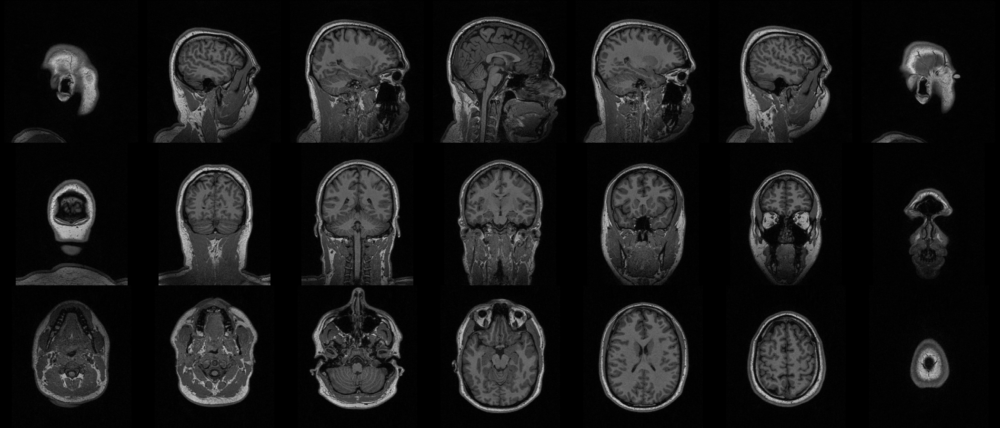

"Hello World" visualization
---------------------------

CLI
++++++

.. code-block:: bash

    nifti_overlay -A t1.nii.gz

Python
++++++

.. code-block:: python

    from nifti_overlay import NiftiOverlay

    overlay = NiftiOverlay()
    overlay.add_anat('t1.nii.gz')
    overlay.plot()