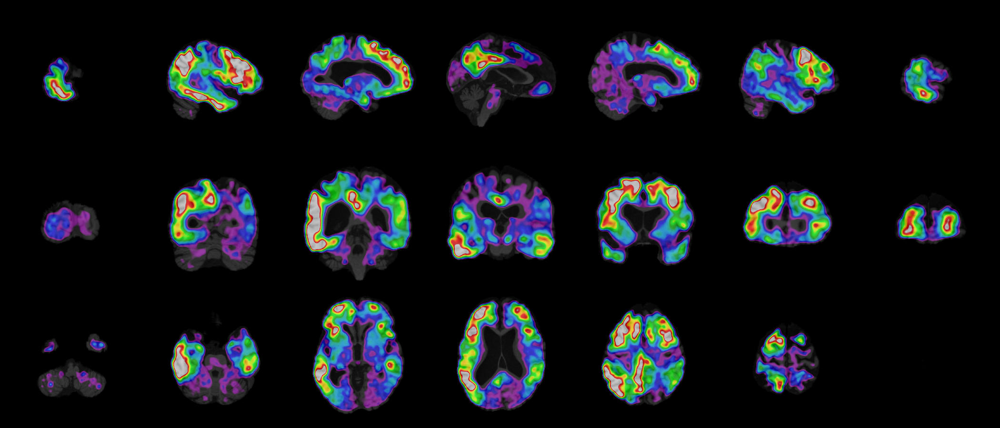

PET SUVR
--------

CLI
++++++

.. code-block:: bash

    nifti_overlay -A t1_mni.nii.gz -A pet_mni.nii.gz -a 0.7 -c nipy_spectral --vmin 1.0 --vmax 2.5

Python
++++++

.. code-block:: python

    from nifti_overlay import NiftiOverlay

    overlay = NiftiOverlay()
    overlay.add_anat('t1_mni.nii.gz')
    overlay.add_anat('pet_mni.nii.gz', alpha=0.7, color='nipy_spectral', vmin=1.0, vmax=2.5)
    overlay.plot()