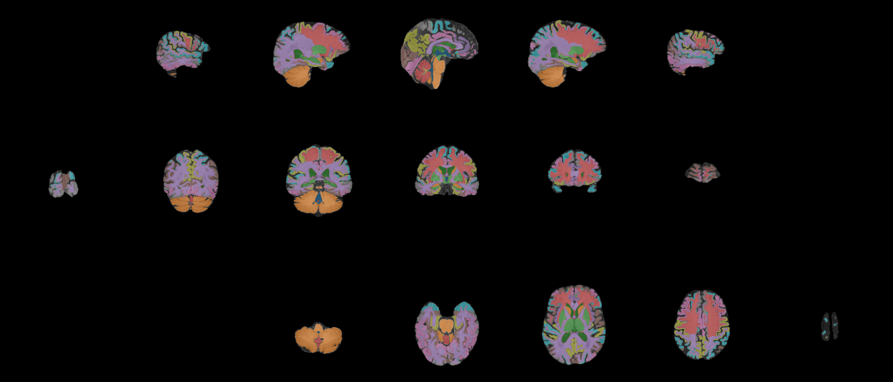

Segmentation
------------

CLI
++++++

.. code-block:: bash

    nifti_overlay -A t1.nii.gz -A segmentation.nii.gz --color 'tab10' -a 0.5 --dropzero

Python
++++++

.. code-block:: python

    from nifti_overlay import NiftiOverlay

    overlay = NiftiOverlay()
    overlay.add_anat('t1.nii.gz')
    overlay.add_anat('segmentation.nii.gz', color='tab10', alpha=0.5, dropzero=True)
    overlay.plot()