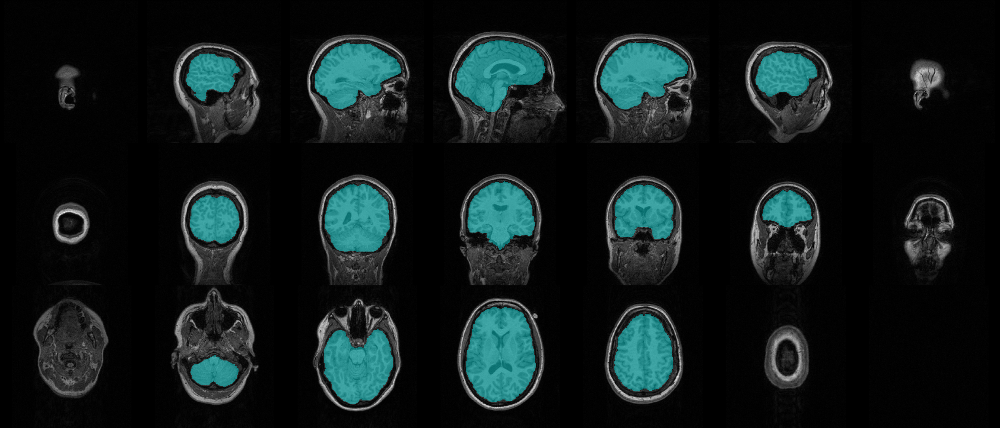

Skullstripping
--------------

CLI
++++++

.. code-block:: bash

    nifti_overlay -A t1.nii.gz -M brainmask.nii.gz -c cyan -a 0.4

Python
++++++

.. code-block:: python

    from nifti_overlay import NiftiOverlay

    overlay = NiftiOverlay()
    overlay.add_anat('t1.nii.gz')
    overlay.add_mask('brainmask.nii.gz', color='cyan', alpha=0.4)
    overlay.plot()