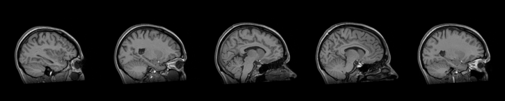

Slice settings
--------------

CLI
++++++

.. code-block:: bash

    nifti_overlay -A t1.nii.gz --minx 0.4 --maxx 0.6 --nslices 5 -x x

Python
++++++

.. code-block:: python

    from nifti_overlay import NiftiOverlay

    overlay = NiftiOverlay(minx=0.4, maxx=0.6, nslices=5, planes='x')
    overlay.add_anat('t1.nii.gz')
    overlay.plot()